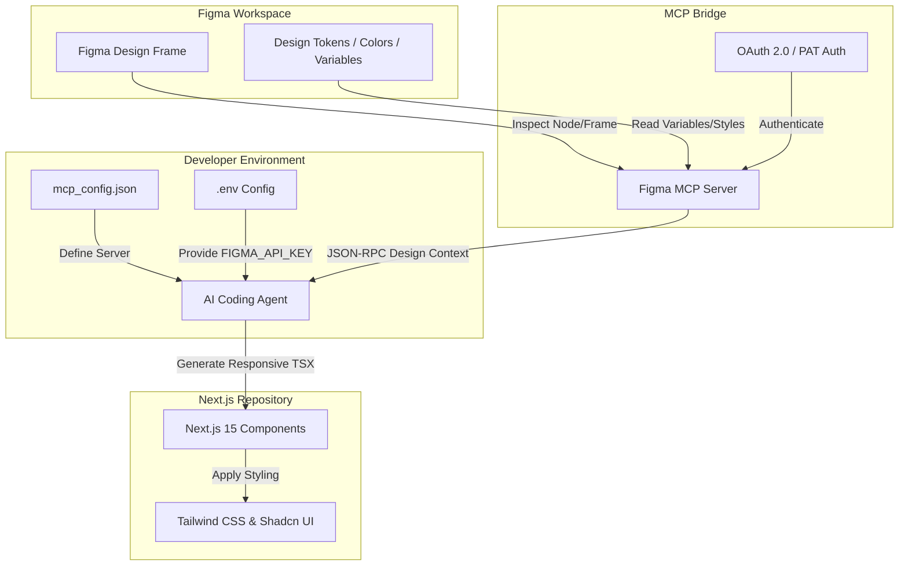

# Figma MCP Integration Guide

This document outlines the setup, authentication, and workflow for the **Figma Model Context Protocol (MCP)** integration in the **ApniSite** development environment.

With this integration, AI coding assistants (such as Antigravity, Claude, or Cursor) can connect directly to Figma's API to inspect frames, layers, design tokens, and components, and automatically generate production-ready Next.js components using **TypeScript**, **Tailwind CSS**, and **Shadcn UI**.

---

## 1. Architecture Flow



---

## 2. Configuration Setup

The environment supports both **Remote (HTTP/SSE)** and **Local (Stdio)** Figma MCP servers.

### Configuration Locations
1. **Global Configuration:** `C:\Users\Thinkpad\.gemini\antigravity-cli\mcp_config.json`
2. **Workspace Configuration:** `C:\Users\Thinkpad\Desktop\projects\apni-site\.agents\mcp_config.json`

Both files have been configured with the following schema:

```json
{
  "mcpServers": {
    "figma": {
      "serverUrl": "https://mcp.figma.com/mcp"
    },
    "figma-local": {
      "command": "cmd.exe",
      "args": [
        "/c",
        "npx",
        "-y",
        "figma-developer-mcp",
        "--stdio"
      ],
      "env": {
        "FIGMA_API_KEY": ""
      }
    }
  }
}
```

---

## 3. Authentication & Environment Variables

To authorize the AI agent to pull designs, follow either of these methods:

### Method A: Figma Personal Access Token (PAT) - Recommended for Local CLI
1. Log in to your [Figma Account](https://www.figma.com).
2. Go to **Settings** > **Account** > **Personal access tokens**.
3. Click **Generate new token**. Give it a descriptive name (e.g., `ApniSite MCP Server`) and select the following scopes:
   - **File content:** `Read`
   - **Dev resources:** `Read`
4. Copy the generated token.
5. Add it to your local environment file:
   - Open your project `.env` file and set the value:
     ```env
     FIGMA_API_KEY="your_figma_personal_access_token_here"
     ```
   - *Note: Ensure `.env` is listed in your `.gitignore` to prevent leaking keys.*

### Method B: OAuth 2.0 Flow - Recommended for IDE GUI Connectors
When connecting through an IDE UI (such as the VS Code / Cursor MCP settings):
1. Navigate to the MCP settings panel.
2. Under the `figma` server, click the **Connect** or **Start** button.
3. This triggers a browser window requesting authorization.
4. Click **Agree and Allow Access** to bind your Figma account to the MCP client.

---

## 4. Connectivity Verification

### Verifying the Remote Server
You can check connectivity to the remote endpoint using the custom node test script in the workspace:
```bash
node C:\Users\Thinkpad\.gemini\antigravity-cli\scratch\test_mcp.js
```
Expected output showing the endpoint is active and listening:
```text
Testing connection to Figma MCP server at https://mcp.figma.com/mcp...
Response Status Code: 405
MCP Endpoint is reachable and active.
```

### Verifying the Local Server Command Execution
Run the CLI tool directly with your API key to check connection and test retrieval of a Figma file:
```bash
npx figma-developer-mcp fetch --figma-api-key="YOUR_FIGMA_API_KEY" "https://www.figma.com/design/YOUR_FILE_ID/YOUR_FILE_NAME"
```

---

## 5. Tool Reference & Design Capabilities

Once connected, the AI agent uses the following MCP tools to query your design data:

| Tool Name | Scope / Purpose | What it extracts |
| :--- | :--- | :--- |
| `get_design_context` | Design Hierarchy | Node tree, structures, auto-layout values, positions, hierarchy |
| `get_metadata` | Frame Overview | List of frames, names, sizes, component IDs, grouping metadata |
| `get_variable_defs` | Design Tokens | Color variables, spacing tokens, font weights, shadows, type styles |
| `get_screenshot` | Visual Reference | A live PNG preview of the selected frame to help align visual styling |
| `get_code_connect_map` | Implementation Mapping | Links Figma design components to pre-written react code components |

---

## 6. How to Use & Generate Next.js Code

Follow this workflow to translate designs into code:

1. **Select / Reference the Figma Frame:** Copy the URL of the specific frame or component in Figma. It should look like this:
   `https://www.figma.com/design/FILE_KEY/File-Name?node-id=NODE_ID`
2. **Prompts:** Give your AI assistant the frame URL and request code generation using the ApniSite design system guidelines.

### Prompt Templates for ApniSite

#### Prompt 1: Component Generation from Selected Frame (General)
> Read the selected Figma frame through MCP and generate a responsive Next.js 15 component using TypeScript, Tailwind CSS, and Shadcn UI. Preserve layout, spacing, typography, colors, and responsiveness.
>
> **Figma Frame URL:** `https://www.figma.com/design/YOUR_FILE_ID/File-Name?node-id=YOUR_NODE_ID`

#### Prompt 2: Design Token & Palette Sync
> Read the variables and tokens from the following Figma design via MCP and update our `index.css` and `tailwind.config.ts` to map the exact color palette, shadows, and spacing rules.
>
> **Figma Design URL:** `https://www.figma.com/design/YOUR_FILE_ID/File-Name`

#### Prompt 3: Converting Autolayout to Flexbox/Grid
> Fetch the design context for this frame. Inspect the Autolayout rules and map them precisely to Tailwind flex/grid classes (e.g. mapping wrap, gaps, padding, and alignments). Ensure you write clean semantic HTML5 markup.
>
> **Figma Frame URL:** `https://www.figma.com/design/YOUR_FILE_ID/File-Name?node-id=YOUR_NODE_ID`

---

> [!IMPORTANT]
> Always verify that your autolayout values in Figma are set up correctly. Unstructured groups without Auto Layout may result in absolute positioning classes (`absolute top-X left-Y`) instead of clean, fluid layouts.
